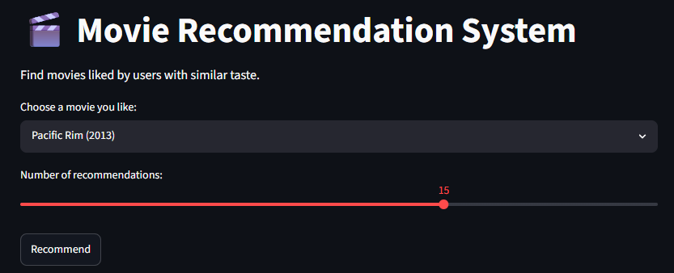
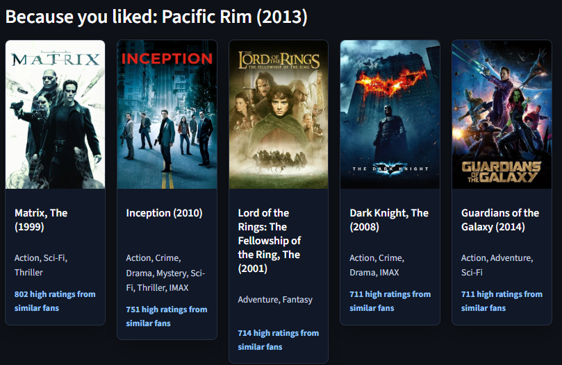

# Movie Recommendation System

A PySpark and Streamlit application that recommends movies from the MovieLens
dataset. Choose a movie you like, and the app returns other movies that were
highly rated by users with similar taste.

## Project Description

This project builds a movie recommendation system around the MovieLens Latest
Dataset. The current application uses a collaborative filtering approach often
described as "people who liked this also liked": it finds users who gave a high
rating to the selected movie, then ranks other movies those same users also
rated highly.

MovieLens was chosen because it is a well-known recommendation dataset with
real user-rating behavior, consistent movie identifiers, and enough scale to
make PySpark useful during exploration and processing.

Technologies used:

- PySpark for loading, joining, filtering, and aggregating the full dataset.
- Streamlit for the interactive web interface.
- Pandas for returning recommendation results in a UI-friendly format.
- Requests for optional TMDB poster API calls.
- python-dotenv for loading local configuration from `.env`.

## Features

- Movie search through the Streamlit selection interface.
- Recommendation engine based on similar users' highly rated movies.
- Streamlit interface with recommendation cards.
- Full MovieLens Latest Dataset support.
- ALS experimentation in the exploratory notebook.
- Optional TMDB poster lookup with a safe placeholder fallback.

## Dataset

The project uses the MovieLens Latest Dataset (`ml-latest`) from GroupLens.
The local dataset included in `data/raw/ml-latest` contains:

- 33,832,162 ratings.
- 330,975 users.
- 86,537 movies.

The raw data is intentionally ignored by git because it is large. Download the
dataset from GroupLens and place the extracted files in:

```text
data/raw/ml-latest/
```

Expected files include:

- `ratings.csv`
- `movies.csv`
- `tags.csv`
- `links.csv`
- `genome-scores.csv`
- `genome-tags.csv`

Data source: GroupLens MovieLens datasets. If you use this project in a
publication or portfolio write-up, credit GroupLens and cite the MovieLens
dataset paper referenced in the dataset README.

Movie posters are retrieved from TMDB when `TMDB_API_KEY` is configured. This
project uses TMDB poster metadata but is not endorsed or certified by TMDB.

## Installation

```bash
git clone <repo>
cd <repo>

python -m venv .venv
source .venv/bin/activate

pip install -r requirements.txt
```

## Environment Variables

Create a `.env` file in the project root:

```bash
cp .env.example .env
```

Then edit `.env` with your TMDB API key:

```env
TMDB_API_KEY=your_tmdb_api_key_here
```

The `.env` file is ignored by git so real API keys are not committed.

## Running the App

```bash
streamlit run app/streamlit_app.py
```

The app works without a poster API key. When no poster is available, it displays
a placeholder image.

To enable movie posters from TMDB, add `TMDB_API_KEY` to `.env` and restart the
Streamlit app.

## Running with Docker

Make sure the MovieLens CSV files are available locally before building:

```text
data/raw/ml-latest/ratings.csv
data/raw/ml-latest/movies.csv
```

Build the image from the project root:

```bash
docker build -t movie-recommendation-pyspark .
```

Run the app:

```bash
docker run --env-file .env -p 8501:8501 movie-recommendation-pyspark
```

Then open:

```text
http://localhost:8501
```

The `.env` file is not copied into the image. Pass it with `--env-file .env` if
you want TMDB posters enabled.

## Project Structure

```text
.
├── app/
│   └── streamlit_app.py        # Streamlit user interface
├── assets/
│   ├── home_page.png           # Home page screenshot
│   └── recommendations.png     # Recommendations screenshot
├── data/
│   ├── raw/ml-latest/          # MovieLens CSV files, ignored by git
│   └── processed/              # Reserved for processed outputs
├── models/                     # Reserved for saved models
├── notebooks/
│   ├── 01_load_data.ipynb      # Data loading, EDA, and ALS experiments
│   └── 02_test_recommender.ipynb
├── src/
│   ├── __init__.py
│   └── recommend.py            # Recommendation and poster helper functions
├── .env.example                # Environment variable template
├── .gitignore
├── README.md
└── requirements.txt
```

## Recommendation Logic

The production recommendation function is:

```python
recommend_similar_movies(movie_title, top_n=10, min_rating=4.5)
```

For a selected movie, it:

1. Finds matching MovieLens movie IDs.
2. Finds users who rated those movies at or above `min_rating`.
3. Finds other movies those users also rated at or above `min_rating`.
4. Counts how often each candidate movie appears.
5. Returns the top results with title, genres, and fan rating count.

## Screenshots

### Home Page



### Recommendations



## Future Improvements

- Add local screenshot assets for the README.
- Add richer movie poster metadata and caching.
- Add ALS-based personalized recommendations.
- Save trained models and processed recommendation tables.
- Add Docker deployment.
- Add cloud deployment.
