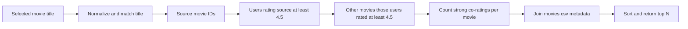
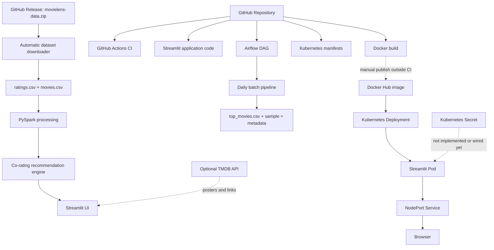

# Movie Recommender: Presentation Notes

## Talk objective

Explain how a PySpark movie recommender grew into a small, production-inspired
data engineering system: data acquisition, processing, recommendations, UI,
orchestration, validation, containerization, and local Kubernetes deployment.

> **Core message:** every tool was added to solve a specific problem. The
> project is deliberately honest about what is production code, what is an
> experiment, and what remains future work.

---

# Part 1 — Dataset summary

## Production inputs

Only two files are required by the production application:

| File | Required columns | Purpose |
|---|---|---|
| `ratings.csv` | `userId`, `movieId`, `rating`, `timestamp` | Historical user preferences and co-rating patterns |
| `movies.csv` | `movieId`, `title`, `genres` | Human-readable titles and genre metadata |

Files such as tags, links, and genome scores may be distributed with some
MovieLens packages, but the current app does not load them.

## Measured full local snapshot

These figures were calculated directly from the current files at
`data/raw/ml-latest/` with PySpark.

| Measure | Result |
|---|---:|
| Rating rows | 33,832,162 |
| Unique users | 330,975 |
| Unique movies rated | 83,239 |
| Rows / unique movie IDs in `movies.csv` | 86,537 / 86,537 |
| Observed rating range | 0.5 to 5.0 |
| Average rating | 3.5425 |
| Earliest rating timestamp | 1995-01-09 11:46:44 UTC |
| Latest rating timestamp | 2023-07-20 08:53:33 UTC |
| Missing values in required rating columns | 0 |
| Missing values in required movie columns | 0 |
| `ratings.csv` size | 933,898,879 bytes, about 890.6 MiB |
| `movies.csv` size | 4,192,335 bytes, about 4.0 MiB |

There are more movies in the metadata file than movies with ratings. That is
expected: 3,298 metadata records have no rating in this local snapshot.

### Top 10 movies by number of ratings

| Rank | Movie | Rating count |
|---:|---|---:|
| 1 | The Shawshank Redemption (1994) | 122,296 |
| 2 | Forrest Gump (1994) | 113,581 |
| 3 | Pulp Fiction (1994) | 108,756 |
| 4 | The Matrix (1999) | 107,056 |
| 5 | The Silence of the Lambs (1991) | 101,802 |
| 6 | Star Wars: Episode IV — A New Hope (1977) | 97,202 |
| 7 | Fight Club (1999) | 86,207 |
| 8 | Schindler's List (1993) | 84,232 |
| 9 | Jurassic Park (1993) | 83,026 |
| 10 | Star Wars: Episode V — The Empire Strikes Back (1980) | 80,200 |

## Local snapshot versus deployment snapshot

The full local `ratings.csv` above is larger than the asset currently published
in the `v1.0-data` GitHub Release. The release ZIP is about 78.9 MiB and its
extracted `ratings.csv` is about 303.8 MiB with 11,808,890 rating rows. Both use
the same required schema, but presentation numbers must be labelled with the
snapshot they describe.

Fresh deployments use the release snapshot automatically. The full local
statistics above should not be presented as the row count of every deployed
instance.

### Reproduce the core statistics

```python
from pyspark.sql import SparkSession, functions as F

spark = SparkSession.builder.master("local[2]").getOrCreate()
ratings = spark.read.csv(
    "data/raw/ml-latest/ratings.csv", header=True, inferSchema=True
)
movies = spark.read.csv(
    "data/raw/ml-latest/movies.csv", header=True, inferSchema=True
)

ratings.agg(
    F.count("*").alias("rating_rows"),
    F.countDistinct("userId").alias("unique_users"),
    F.countDistinct("movieId").alias("unique_movies_rated"),
    F.min("rating").alias("minimum_rating"),
    F.max("rating").alias("maximum_rating"),
    F.avg("rating").alias("average_rating"),
    F.min("timestamp").alias("first_timestamp"),
    F.max("timestamp").alias("last_timestamp"),
).show(truncate=False)
```

### Speaker notes

- “The ratings file is behavioral data: who rated which movie, how highly, and
  when.”
- “The movies file is reference data: it turns a movie ID into a title and
  genres.”
- “The recommendation signal comes from ratings; movie metadata makes the
  output understandable.”
- “The app needs only these two files, which keeps its production input contract
  simple.”

---

# Part 2 — Data sources

## MovieLens

MovieLens is a research dataset from the GroupLens project containing
anonymized movie-rating activity. It is suitable here because it provides:

- millions of historical user–movie interactions;
- stable identifiers that connect ratings to movie metadata;
- a numeric preference signal suitable for Spark aggregations; and
- enough volume to demonstrate distributed-style processing locally.

A rating is historical behavior, not a live statement of intent. It tells us
that a user assigned a score to a movie at a recorded time. The production
heuristic uses strong historical ratings to identify groups of users with
overlapping tastes.

`movies.csv` contributes titles and pipe-delimited genres. It does not drive the
similar-user calculation; it enriches IDs after candidates have been ranked.

The raw files are excluded from Git because Git is optimized for source history,
not large changing binary/data artifacts. Committing hundreds of megabytes
would make every clone and repository operation unnecessarily heavy.

## TMDB API

The Movie Database API is optional presentation enrichment. The app uses it to
search for poster images and links users to TMDB movie pages.

TMDB is **not** part of the recommendation signal. Without `TMDB_API_KEY`, the
same MovieLens/PySpark recommendation flow works and the UI uses a generated
placeholder poster. Network and API failures are caught so optional enrichment
does not break the recommender.

## GitHub Releases

The two required CSVs are packaged in `movielens-data.zip` on the repository's
`v1.0-data` GitHub Release. `src/download_data.py` provides the startup flow:

1. Check that both required files exist and are non-empty.
2. If either is missing, create `data/raw/ml-latest/`.
3. Stream the direct GitHub Release asset to a temporary ZIP.
4. Verify SHA-256 digest
   `fc6cb295ce8d32a95b325bdd43474444ee40076122765df9d79c10eca8144c5f`.
5. Check that the archive contains both required filenames without duplicates.
6. Extract into a temporary staging directory.
7. Atomically move both CSVs into the production data directory.
8. Remove the ZIP and staging files, including on handled failures.

The Streamlit app runs this check before creating the Spark session. A clear UI
error is shown if the dataset cannot be provisioned.

### Speaker notes

- “Git stores code; the Release stores the large distributable data artifact.”
- “The checksum proves that the downloaded bytes match the asset expected by
  this version of the code.”
- “TMDB improves presentation, but MovieLens remains the analytical source of
  truth.”

---

# Part 3 — Recommendation logic

## Current production flow



1. A user searches for a movie in Streamlit.
2. The app removes the year for exact normalized matching and falls back to a
   title substring match if necessary.
3. It finds users who rated the selected movie at least `4.5` by default.
4. It finds other movies those same users also rated at least `4.5`.
5. It groups candidates by `movieId` and counts those high-rating events.
6. It removes the selected source movie.
7. It joins candidates with `movies.csv` for titles and genres.
8. It sorts by `fan_rating_count`, then title, and returns the requested top N.
9. A small Pandas DataFrame carries the final limited result into Streamlit.

This is a deterministic **co-rating heuristic**: “people who strongly liked
this movie also strongly liked these movies.” It is not a trained personalized
model, does not learn latent factors, and does not use the current visitor's
rating history.

## Experimental ALS notebook

`notebooks/01_load_data.ipynb` explores Spark MLlib Alternating Least Squares:

- a 5% ratings sample;
- an 80/20 train/test split;
- in-memory ALS training;
- predictions and RMSE evaluation; and
- experimental per-user recommendations.

That model is not saved, registered, or loaded by the app. The production code
in `src/recommend.py` uses the co-rating method described above. ALS is valid
experimental work and a future direction, but it must not be presented as the
current production recommender.

### Speaker notes

- “The current algorithm is easy to explain and inspect: every recommendation
  has a visible co-rating count.”
- “ALS was explored, but deploying it would require model persistence,
  validation, versioning, and a user-profile strategy.”

---

# Part 4 — Full stack architecture



## Diagram blocks in plain language

| Block | Explanation |
|---|---|
| GitHub Repository | Version-controlled source, tests, docs, Dockerfile, DAG, and manifests |
| GitHub Actions CI | Validates syntax/files, runs unit tests and a fixture Spark pipeline; Docker build is optional/manual |
| Streamlit application | Search UI, recommendation cards, dataset startup check, Spark session cache, and graceful errors |
| Airflow DAG | Schedules five visible batch tasks daily with dependencies, one retry, and run logs |
| Kubernetes manifests | Define one Deployment and one NodePort Service for local cluster use |
| Docker build | Packages Python, Java, dependencies, and application code; raw data is intentionally excluded |
| GitHub Release | Stores the large dataset ZIP separately from Git history |
| Dataset downloader | Verifies, extracts, installs, and cleans up the Release asset |
| PySpark | Reads CSVs and executes filters, joins, groupings, sorting, and batch aggregates |
| Recommendation engine | Implements the production high-rating/co-rating heuristic |
| Streamlit UI | Presents search, posters, metadata, ranked results, and real result counts |
| TMDB API | Optional posters and outbound detail links; never required for recommendations |
| Daily batch pipeline | Validates files/schema, creates top-movie and sample recommendation outputs, writes metadata |
| Docker Hub | Distribution location referenced as `seanstech/movie-recommendation-pyspark:latest`; no repository workflow publishes it |
| Kubernetes Deployment | Requests one replica and recreates a Pod when the managed Pod disappears |
| Pod | Runs the container and Streamlit process on port 8501 |
| NodePort Service | Selects Pods labelled `app: movie-recommender` and exposes port 8501 through Minikube |
| Kubernetes Secret | A sensible future way to inject `TMDB_API_KEY`, but no Secret manifest or Deployment reference currently exists |

---

# Part 5 — Technology stack

| Layer | Tool | What it is | Implementation in this project | Why it matters |
|---|---|---|---|---|
| Language | Python | General-purpose programming language | App, downloader, recommender, pipeline, DAG, and tests; CI/Docker use Python 3.11 | One language across UI and data processing |
| Processing | PySpark | Python API for Apache Spark | CSV reads, DataFrame filters, joins, aggregations, sorting, ALS experiment | Handles millions of rating events with declarative transformations |
| Result bridge | Pandas | In-memory tabular library | Converts only final limited recommendations and top-movie outputs | Simple handoff to Streamlit/CSV without collecting full raw data |
| Analytical data | MovieLens | Anonymized movie ratings and metadata | `ratings.csv` plus `movies.csv` | Supplies behavioral preference signals and movie labels |
| Optional enrichment | TMDB API | Movie metadata/poster web API | On-demand poster search and TMDB links with timeouts/fallbacks | Improves UI without coupling core recommendations to an API |
| Artifact distribution | GitHub Releases | Storage for versioned release assets | Hosts `v1.0-data/movielens-data.zip` | Keeps large data out of Git while enabling fresh deployments |
| UI | Streamlit | Python web application framework | Search, ranked cards, selected movie, caching, errors, status | Makes the Spark workflow interactive with little frontend infrastructure |
| Container | Docker | Image packaging/runtime | Python 3.11 Bookworm image, Java runtime, dependencies, Streamlit command | Reproducible runtime across machines |
| Image registry | Docker Hub | Container image registry | Kubernetes references `seanstech/movie-recommendation-pyspark:latest`; publishing is not automated here | Lets a cluster pull a portable image |
| Orchestration | Apache Airflow 3.2.2 | Scheduler and workflow orchestrator | Daily five-task TaskFlow DAG, retries, task logs, local standalone setup | Makes batch dependencies and run history visible |
| CI | GitHub Actions | Repository automation | Push/PR/nightly/manual workflow; Python/Java setup, tests, fixture pipeline, optional Docker build | Detects regressions without processing the full dataset |
| Local cluster | Kubernetes / Minikube | Container orchestration and local Kubernetes runtime | Intended local target for the checked-in manifests | Demonstrates scheduling, service discovery, replacement Pods |
| Workload controller | Kubernetes Deployment | Desired-state controller for Pods/ReplicaSets | One replica, rolling-update strategy, always pulls `latest` | Recreates a Pod after deletion or failure |
| Runtime unit | Kubernetes Pod | Smallest deployable Kubernetes workload | Runs one Streamlit container on port 8501 | Encapsulates the running application |
| Networking | Kubernetes Service | Stable selector-based network endpoint | NodePort service maps port 8501 to matching Pods | Keeps access stable when a Pod is replaced |
| Secret management | Kubernetes Secret | Kubernetes object for sensitive values | **Not currently implemented or referenced by the Deployment** | Would be preferable to embedding `TMDB_API_KEY` in a manifest |
| Local configuration | `.env` | Local key/value configuration file | Optional `TMDB_API_KEY`; ignored by Git and Docker | Keeps a developer's API key outside source control |
| Version control | Git / GitHub | Source history and collaboration platform | Code, docs, CI config, manifests, and releases | Reproducibility, review, automation, and distribution |

GitHub Secrets are not included in the table because the current workflows do
not reference `${{ secrets.* }}`. In particular, CI does not log in to Docker
Hub and does not push an image.

---

# Part 6 — Presentation story and speaker notes

## 1. Start with the problem

**Story:** A movie catalog is easy to browse but difficult to personalize. The
question is: given one movie a person likes, what else did similar fans rate
highly?

**Speaker note:** “I chose an explainable item-to-item experience rather than
claiming full personalization without a logged-in user's history.”

## 2. Introduce MovieLens

**Story:** `ratings.csv` contains behavioral events and `movies.csv` translates
IDs into titles and genres.

**Speaker note:** “The full local snapshot has 33.8 million ratings. That scale
is enough to make the Spark operations meaningful.”

## 3. Explain why PySpark

**Story:** Spark DataFrames express the work as filters, joins, groups, counts,
and sorts while avoiding loading the full dataset into Pandas.

**Speaker note:** “Pandas appears only at the small output boundary; Spark does
the large-data work.”

## 4. Generate recommendations

**Story:** Select a film, identify its high-rating fans, collect their other
high ratings, count candidates, attach metadata, and return the top results.

**Speaker note:** “This is a co-rating heuristic, not the experimental ALS
model. Its strength is clarity; its limitation is that it is not personalized
to a complete user profile.”

## 5. Add Streamlit

**Story:** Streamlit turns Python results into an interactive search and card
interface. Spark and title data are cached; TMDB posters are optional.

**Speaker note:** “The UI exposes real recommendation counts rather than
invented confidence percentages.”

## 6. Move the dataset out of Git

**Story:** Raw data made the repository heavy, so it was excluded by
`.gitignore` and `.dockerignore`.

**Speaker note:** “Source control and large artifact distribution are different
jobs.”

## 7. Automate dataset provisioning

**Story:** A GitHub Release holds a ZIP. Startup downloads it only when needed,
checks its digest and contents, stages extraction, and cleans temporary files.

**Speaker note:** “A fresh clone or container no longer needs a manual data
step, provided it can reach GitHub Releases and has writable disk space.”

## 8. Add Docker

**Story:** Docker packages Python 3.11, Java, requirements, and application code.
The same startup downloader runs inside the container.

**Speaker note:** “The image stays small because it does not bake in the raw
dataset.”

## 9. Distribute through Docker Hub

**Story:** The Kubernetes manifest references
`seanstech/movie-recommendation-pyspark:latest`.

**Speaker note:** “The image exists as a deployment dependency, but this repo
does not automate Docker Hub login or push. Publishing is currently a manual
step.”

## 10. Add Airflow

**Story:** A daily DAG checks files, validates schema, runs Spark aggregation,
creates a sample recommendation, and writes run metadata.

**Speaker note:** “Airflow orchestrates; Spark processes. Airflow does not
replace the recommendation engine.”

## 11. Add GitHub Actions

**Story:** CI runs on pushes, pull requests, nightly, and manually. It installs
Python/Java, checks source and required files, runs unit tests, and executes the
pipeline against a tiny fixture.

**Speaker note:** “CI proves the flow without downloading and processing the
large production snapshot.”

## 12. Add Kubernetes

**Story:** A Deployment declares one desired application replica and a Service
provides a stable endpoint in Minikube.

**Speaker note:** “This is local Kubernetes practice, not evidence of a managed
production cluster.”

## 13. Explain Deployment, Service, and Secret

**Story:** The Deployment owns the Pod; the Service selects the Pod by label and
routes traffic. A Secret would inject `TMDB_API_KEY` without putting it in the
image or source.

**Speaker note:** “The checked-in project currently implements Deployment and
Service only. Secret injection is the correct next step, not a feature I claim
today.”

## 14. Demonstrate Pod recovery

**Story:** Deleting the managed Pod makes the Deployment controller create a
replacement to restore the desired replica count. The Service's label selector
then targets the replacement.

**Speaker note:** “This demonstrates Kubernetes reconciliation. It is not full
application resilience: the project has no readiness probe, persistent volume,
autoscaling, or multi-replica design.”

---

# Part 7 — Demo commands

Run commands from the repository root unless noted otherwise.

## Local Streamlit

```bash
python -m venv .venv
source .venv/bin/activate
pip install -r requirements.txt
streamlit run app/streamlit_app.py
```

The dataset downloads automatically on the first run if either required CSV is
missing. Open `http://localhost:8501`.

## Airflow

Use the dedicated Airflow environment described in `docs/airflow.md`:

```bash
source .venv-airflow/bin/activate
export MOVIE_RECOMMENDER_PROJECT_ROOT="$PWD"
export AIRFLOW_HOME="$PWD/.airflow"
export AIRFLOW__CORE__DAGS_FOLDER="$PWD/dags"
airflow standalone
```

Keep the terminal open and use the URL and generated credentials printed by
Airflow, normally at `http://localhost:8080`. Find, enable, and trigger
`movie_recommender_batch_pipeline`.

## Docker

```bash
docker build -t movie-recommendation-pyspark .
docker run --env-file .env -p 8501:8501 movie-recommendation-pyspark
```

The container needs outbound GitHub access on first startup. If no `.env` file
is used, omit `--env-file .env`; recommendations still work without TMDB.

## Docker Hub

The image name referenced by the Kubernetes Deployment is:

```bash
docker pull seanstech/movie-recommendation-pyspark:latest
docker run --env-file .env -p 8501:8501 \
  seanstech/movie-recommendation-pyspark:latest
```

The repository does not contain an automated Docker Hub push workflow. Before
a demo, confirm that this tag exists and reflects the current source.

## Kubernetes / Minikube

Commands that work with the manifests currently present:

```bash
minikube start
kubectl apply -f k8s/deployment.yaml
kubectl apply -f k8s/service.yaml
kubectl get deployment,pods,service
minikube service movie-recommender
```

### Important Secret caveat

The requested command below is **not currently runnable** because
`k8s/secret.example.yaml` does not exist and `deployment.yaml` does not consume
`TMDB_API_KEY` from a Kubernetes Secret:

```bash
# Future command after a Secret manifest and Deployment reference are added:
kubectl apply -f k8s/secret.example.yaml
```

Do not create or commit a manifest containing a real API key. Until Secret
injection is implemented, the Kubernetes deployment runs with placeholder
posters.

### Self-healing demo

```bash
kubectl get pods
kubectl delete pod <pod-name>
kubectl get pods -w
```

Point out the old Pod terminating and a new Pod being created by the Deployment.
Press `Ctrl+C` after the replacement reaches `Running`.

---

# Part 8 — Honest claims

## What this project demonstrates

- PySpark CSV ingestion and batch DataFrame processing.
- An explainable production co-rating recommendation heuristic.
- A Streamlit search and recommendation UI.
- Automatic, checksum-verified dataset provisioning from GitHub Releases.
- Optional TMDB poster enrichment with graceful fallback behavior.
- Small Pandas outputs at the application/export boundary.
- Docker containerization with Java and Python dependencies.
- Use of a Docker Hub image from a Kubernetes manifest.
- A daily five-task Airflow DAG with dependencies, retry, logs, and metadata.
- GitHub Actions CI with tests and a fixture-based Spark pipeline.
- Kubernetes Deployment and NodePort Service manifests.
- Deployment-controller replacement of a deleted Pod in Minikube.
- Local `.env` secret hygiene for the optional TMDB key.

## What this project does not yet do

- No production cloud Kubernetes cluster is configured.
- No Kubernetes Secret is checked in or wired to the Deployment.
- No automated Docker Hub login, push, or release pipeline exists.
- No production database, warehouse, data lake, or object-store integration.
- No real-time ratings stream, message broker, CDC, or incremental pipeline.
- No production-grade monitoring, alerting, tracing, or centralized logs.
- No readiness/liveness probes, resource requests/limits, autoscaling, or
  persistent Kubernetes storage.
- No multi-replica/high-availability application architecture.
- No managed production Airflow deployment; the documented setup is local.
- No production ALS model. ALS remains notebook-only and no model artifact is
  saved or served.
- No user accounts or persistent individual preference profiles.
- No claim that TMDB metadata affects recommendation ranking.
- No GitHub Secrets usage in the current CI workflow.

---

# Part 9 — Closing summary

This project started as a PySpark movie recommender and evolved into a small
production-inspired Data Engineering system. Each tool was added to solve a
specific problem: Spark for processing, Streamlit for interaction, GitHub
Releases for dataset distribution, Docker for portability, Airflow for
orchestration, GitHub Actions for validation, and Kubernetes for deployment and
self-healing.

> **Final speaker line:** “The value is not the number of tools; it is that each
> tool has a clear responsibility, a working integration point, and an honest
> boundary.”
